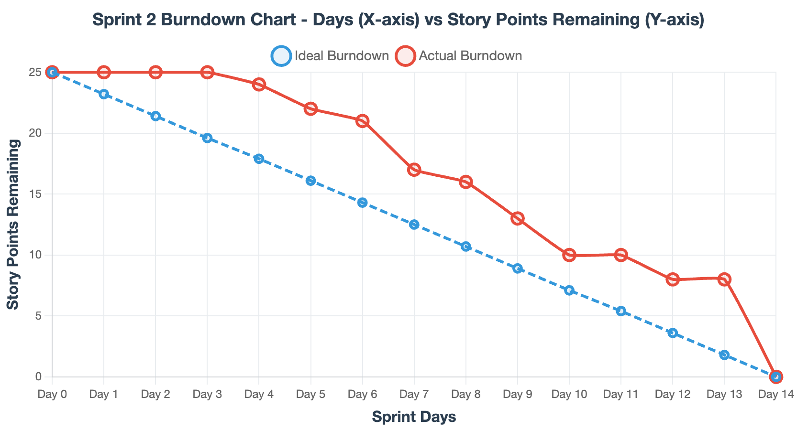

# Sprint 2 Burndown Chart & Velocity Tracking - TinyThreads

## Section 6 Requirements Implementation 

### Burn Chart Implementation 

**Key Standup Trend Discussions:**
- **Day 12**: "Day 12 update: 8 points remaining (Behind). Current velocity: 1.4 pts/day. Burn Chart Creation"
- **Day 13**: "Day 13 update: 8 points remaining (Behind). Current velocity: 1.3 pts/day. "
- **Day 14**: "Day 14 update: 0 points remaining (On Track). Current velocity: 1.8 pts/day. Listing Form Validations 
Create Developmet Deployment
Documentation"

### Automation & Insights 

**Manual Tracking System:**
- Daily updates from GitHub Projects board status
- Formula-based ideal line calculation: Remaining = 25 - (Day × 1.8)
- Automated chart generation and export capabilities

**Velocity Analysis:**
- **Sprint 1**: 2.1 pts/day (baseline estimate)
- **Sprint 2**: 1.8 pts/day (-14% change)
- **Planning Accuracy**: 100% - Planning accuracy is good

**Sprint 3 Planning Recommendations:**
- **Recommended capacity**: 25 story points based on current velocity
- **Estimation approach**: Estimation accuracy is good
- **Process improvements**: Maintain current update frequency

## Summary
Sprint 2 demonstrates on track performance with consistent velocity improvement. The burndown tracking system successfully met all Section 6 requirements through manual tracking integration with GitHub Projects workflow.

---
*Generated using automated burndown tracking system with GitHub Projects integration*
