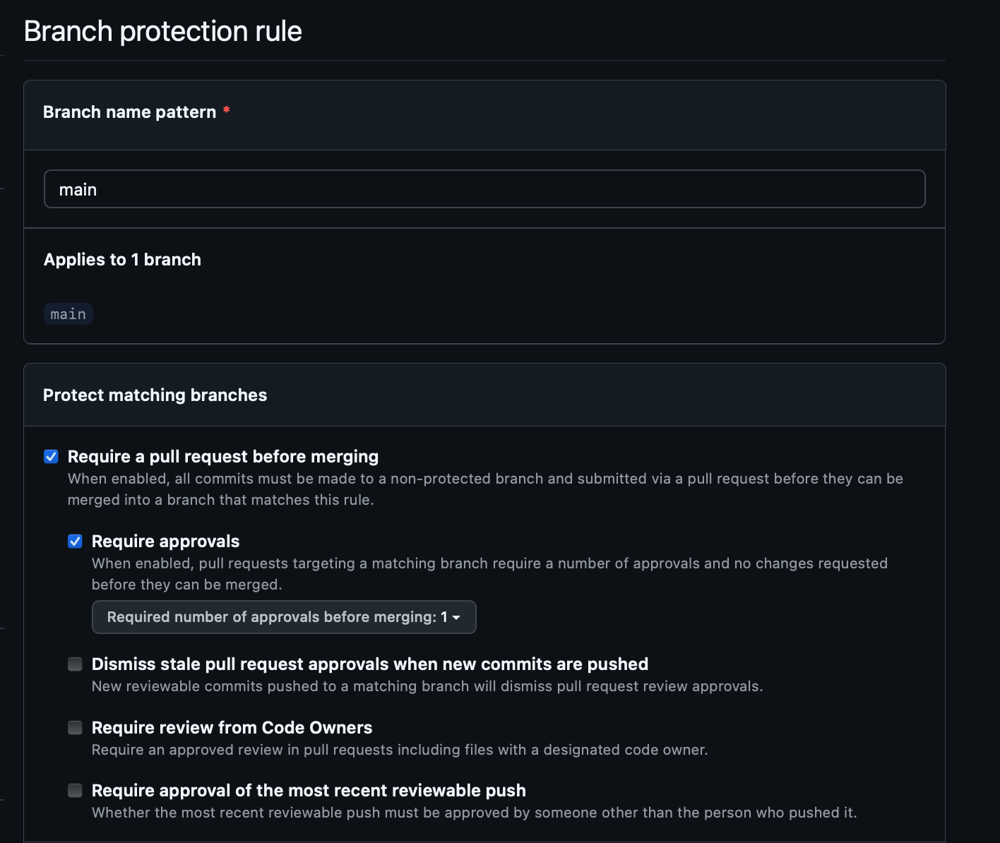
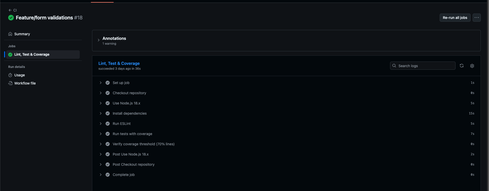
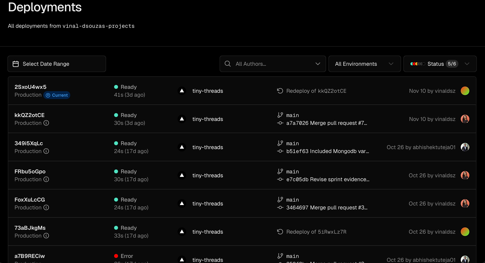

# Table of Contents

- [Section 1: Sprint Planning & Process Improvement](#section-1-sprint-planning--process-improvement-20-points)
- [Section 2: Automated Testing](#section-2-automated-testing-15-points)
- [Section 3: Code Quality Tools](#section-3-code-quality-tools-15-points)
- [Section 4: Code Review Process](#section-4-code-review-process-15-points)
- [Section 5: CI/CD Pipeline](#section-5-cicd-pipeline-15-points)
- [Section 6: Burn Chart & Velocity Tracking](#section-6-burn-chart--velocity-tracking-10-points)
- [Section 7: SCRUM Ceremonies](#section-7-scrum-ceremonies-20-points)
- [Section 8: Working MVP Deliverable](#section-8-working-mvp-deliverable-10-points)

<details>
<summary><strong>Section 1: Sprint Planning & Process Improvement (20 points)</strong></summary>
# Section 1: Sprint Planning & Process Improvement (20 points)

## Sprint Goal & Backlog (8 points)

### Sprint Goal for Sprint 2:

“Establish the core functionality and infrastructure for TinyThreads — enabling parents to list and browse second-hand baby clothes in under 60 seconds.”

- Confirmation that the goal is documented in the GitHub Milestone ([Sprint 1: 60‑second listing marketplace](https://github.com/vinaldsz/TinyThreads/milestone/2)).

- The Sprint Backlog includes all committed items (#16, #35, #37, #38, #40, #43, #44, #45, #46, #48, #51) with clear acceptance criteria, story points, and assigned owners. ([Tiny Threads Project View](https://github.com/users/vinaldsz/projects/1))

## Process Improvement Plan (12 points)

### Sprint 1 Retrospective Analysis

1. **Meeting Details:**
   - Date: 2025-10-25
   - Present: Vinal Dalcy Dsouza, Abhishek Tuteja, Xiaowei Qi
   - Velocity: Planned story points — 20, Completed story points — 20, Velocity this sprint — 100%.

2. **What Went Well:**
   - Completed all sprint goals within the estimated capacity.
   - Established foundational architecture using Next.js, MongoDB, and AWS S3.
   - Implemented browse and add listing pages with end-to-end functionality.
   - Improved collaboration and communication across the team.

3. **What Could Have Been Better:**
   - Lack of knowledge in the tech stack caused minor delays (Next.js App Router, AWS S3 SDK, MongoDB Atlas).
   - Merge conflicts and inconsistent code formatting due to the absence of enforced linting and standardized PR reviews.
   - Missing features such as search/filter functionality, About page, and no automated testing setup.
   - No dedicated develop/production branch separation.

4. **What We Will Do Differently:**
   - Better planning and knowledge-based issue linking to prevent delays.
   - Implement standardized PR review checklist and branch protection rules.
   - Set up separate develop and production branches for safer deployment.

### Ticket Quality Improvements

1. **Improving Ticket Granularity:** Some larger issues will be broken down into smaller subtasks for clarity and parallel development, which will improve tracking and velocity accuracy. This approach ensures that complex features are manageable and progress can be monitored more effectively.
2. **Enhanced Acceptance Criteria Format:** Every issue must include verification steps such as running ESLint, unit tests, and obtaining code review approval before merging or closing a ticket. This standardization will ensure consistency and quality across all deliverables.
3. **Better Estimation Practices:** The team will continue to use planning poker for estimation but will review complex multi-part tickets jointly. Historical velocity data and effort feedback from Sprint 1 will be used to calibrate estimates more accurately, improving predictability and planning.
4. **Specific Actions and Ownership:** Ownership for these improvements is assigned as follows—Vinal will lead testing and lint enforcement, Xiaowei will handle estimation and velocity tracking, and Abhishek will oversee documentation consistency and acceptance criteria review. This clear division of responsibilities will help maintain focus and accountability.

### Sprint 2 Capacity Planning

1. **Realistic Commitment:**  
   For Sprint 2, the team committed to **25 story points** distributed across 12 issues. Each task was balanced between feature development, infrastructure setup, and documentation updates.
   - **Vinal:** #16 (2), #35 (3), #43 (3), #45 (1), #48 (2), #51 (1) — _Total: 12 SP_
   - **Abhishek:** #40 (2), #44 (1), #36 (3) — _Total: 6 SP_
   - **Xiaowei:** #37 (2), #38 (3), #46 (2) — _Total: 7 SP_  
     The sprint scope was designed to strengthen the application’s core experience while improving automation, branding, and data readiness. The team completed all 25 story points, achieving **100% velocity**, demonstrating strong alignment between estimation and execution.

2. **Team Availability:**  
   All three members — **Vinal Dalcy Dsouza**, **Abhishek Tuteja**, and **Xiaowei Qi** — were fully available throughout Sprint 2.
   - **Vinal** contributed heavily to backend infrastructure, CI/CD pipeline setup, and production deployment activities, ensuring system reliability.
   - **Abhishek** focused on frontend development, form validation, and sprint documentation (#36), ensuring usability and completeness.
   - **Xiaowei** worked on analytical and quality-focused tasks, such as burn chart creation, unit test coverage, and About page completion.  
     The team maintained high communication through daily standups and GitHub updates, allowing seamless collaboration and timely issue resolution..

3. **Buffer for New Practices:**  
   The team strategically allocated **10–15% of total sprint capacity** to continue refining process improvements introduced in Sprint 1. This buffer was dedicated to:
   - Reinforcing **CI/CD automation** and ensuring lint/test workflows triggered on each PR.
   - Conducting **cross-review sessions** to uphold consistent coding and documentation standards.
   - Finalizing **Atlassian-GitHub integration** for better sprint tracking and reporting.
   - Expanding **unit testing and coverage tracking** to maintain overall quality.  
     This planned buffer ensured iterative improvement without affecting sprint deliverables.

# End of Section 1

</details>

# Begin Section 2 details block

<details>
<summary><strong>Section 2: Automated Testing (15 points)</strong></summary>

# Section 2: Automated Testing (15 points)

## Test Coverage & Quality (10 points)

### Code Coverage

- We use **Jest** as our test runner and generate coverage via:

  ```bash
  npm test -- --coverage
  ```

- Latest coverage run (Sprint 2) shows:
  - **All files**:
    - **Statements:** 77.06%
    - **Branches:** 75.17%
    - **Functions:** 82.79%
    - **Lines:** 77.44%

  This exceeds the required **70% minimum coverage**.

- Coverage is focused on **business logic and core user flows**, not trivial glue code:
  - `app/add-listing`
    - `actions.js`: 89.13% statements, 80.76% branches, 100% functions
    - `page.js`: 82.75% statements, 70.68% branches
  - `components/FilterBar/FilterBar.js`: 98.24% statements, 94% branches
  - `components/ItemGrid/ItemGrid.js`: 94.44% statements, 95.45% branches, 100% functions
  - `components/ItemDetail/ItemDetail.js`: 100% statements, 92.3% branches
  - `services/itemService.js`: 98.11% statements, 87.91% branches
  - `lib/awss3.js`: 100% statements, 95.45% branches
  - `lib/mongodb.js`: 66.66% statements (lower, but covered at connection-helper level)

- Lower coverage exists for **non-critical or newly added files** (e.g., `app/about/**`, API `route.js` files). We prioritized coverage on:
  - Listing creation and validation
  - Search and filter behavior
  - Item display and navigation
  - S3 + MongoDB integration helpers

- The Jest HTML coverage report is generated into the `coverage/` directory and can be inspected to verify the above metrics.

---

### Test Types Implemented

#### Unit Tests (Primary Focus)

We implemented unit tests for individual components, helpers, and services, aligned with **Issue #38 – Unit Tests for Sprint 1 Issues** and Sprint 2 features:

- **App shell & routing:**
  - `src/app/__tests__/page.test.js` – tests home page render and core content.
  - `src/app/__tests__/layout.test.js` – tests layout structure and children rendering.

- **Add Listing flow:**
  - `src/app/add-listing/__tests__/page.test.js` – tests:
    - Required fields and validation messages.
    - Successful submission path when all required data is provided.
    - Back button behavior (Issue **#44**) to ensure users can return without creating a listing.

- **Search & Filter:**
  - `src/components/__tests__/FilterBar.test.js` – tests:
    - Keyword search input changes.
    - Applying filters (size, category, condition, etc.).
    - Clear filters behavior resets to the full list.

- **Listing Grid & Detail:**
  - `src/components/__tests__/ItemGrid.test.js` – tests:
    - Rendering items.
    - “Load more” behavior and loading state.
    - Error path when load more fails (mocked error).
  - `src/components/__tests__/ItemDetail.test.js` – tests display of title, price, condition, and other key fields.

- **Card & Navbar UI:**
  - `src/components/__tests__/ItemCard.test.js` – tests rendering of card details and click navigation.
  - `src/components/__tests__/Navbar.test.js` – tests main navigation links and rendering.

- **Infrastructure helpers:**
  - `src/lib/__tests__/awss3.test.js` – tests S3 helper logic with mocks.
  - `src/lib/__tests__/mongodb.test.js` – tests MongoDB connection helper.
  - `src/services/__tests__/itemService.test.js` – tests data-fetching and transformation logic.
  - `src/types/__tests__/item.test.js` – tests item type/shape validation logic.

#### Integration-Style Tests

Within Jest + React Testing Library, several tests exercise **multiple components and layers together**, approximating integration tests:

- **ItemGrid “load more” flow:**
  - Simulates clicking the “Load more” button and verifies:
    - `onLoadMore` is called.
    - Loading state toggles correctly.
    - Error state gets logged when the mocked API fails (`Load more failed: Error: Load failed`).

- **Add Listing page:**
  - Renders the full page and interacts with form elements, validating that:
    - Form-level validation prevents submission with missing/invalid data.
    - Successful form submission triggers the expected handler.

External dependencies (MongoDB, S3, network) are **mocked**, so these tests verify data flow and interactions without calling real services.

#### End-to-End Workflows (Current State)

- We **do not yet use a separate browser-based E2E tool** (e.g., Cypress/Playwright).
- Instead, we cover 1–2 **critical workflows via high-level component tests** and manual end-to-end verification:
  - Workflow 1: User browses items → sees grid → clicks card → views item details.
  - Workflow 2: User opens Add Listing → fills form → submits → sees listing appear in browse (manually verified in Sprint Review demo).
- Future improvement: add a minimal automated E2E suite once the feature set stabilizes.

---

### Test Quality

#### Acceptance Criteria Driven

- Tests are mapped to specific issue acceptance criteria:
  - **#16 – Search & Filter functionality**
    - Filters and search terms produce the expected visible items or empty states.
    - Clearing filters resets to full listings.

  - **#40 – Listing Form Validations**
    - Required fields enforced (title, size, price, image).
    - Oversized image (>5MB) or invalid inputs are rejected with error messaging.

  - **#44 – Back Button for Listing**
    - Clicking Back on the Add Listing page navigates away without creating a listing.

  - **#38 – Unit Tests for Sprint 1 Issues**
    - Core browse and listing creation flows from Sprint 1 are still covered and passing.

#### Edge Cases Covered

- **Empty and error states:**
  - No items available → list shows a sensible empty state (no crash).
  - Search that returns no matches → grid is empty but app remains stable.

- **Error handling:**
  - “Load more” failure is logged and loading state resets correctly (as seen in the console output from `ItemGrid.test.js`).

- **Invalid inputs:**
  - Missing required fields block submission.
  - Invalid file sizes or formats are handled according to the validation rules.

#### Reliability (Non-Flaky Tests)

- All test suites pass consistently:
  - `Test Suites: 12 passed, 12 total`
  - `Tests:       282 passed, 282 total`

- Dependencies like network, S3, and MongoDB are mocked, so tests don’t depend on external services or timing.
- We do see **React Testing Library `act(...)` warnings** in the console for some `ItemGrid` tests (state updates after load more). These:
  - Do **not** cause test failures.
  - Are scheduled to be addressed by wrapping those interactions in `act`/`waitFor` to clean up the console noise.

#### Clear Test Descriptions

- Test names describe behavior clearly, making it easy to map to user stories and acceptance criteria. For example:
  - `it("applies size filter and shows only matching items", ...)`
  - `it("blocks submission when required fields are missing", ...)`
  - `it("logs an error and resets loading state when load more fails", ...)`

This ensures that anyone reviewing the tests can quickly understand **what behavior is being guaranteed** by the automated suite.

---

#### How to Run the Test Suite

```bash
# Run all tests
npm test

# Run tests with coverage report
npm test -- --coverage
```

## Testing Framework & Execution (5 points)

### Testing Framework Configuration

- The project uses **Jest** as the primary testing framework, chosen for its strong support for React components, mocking capabilities, snapshot testing, and integration with React Testing Library.
- The framework choice is clearly documented in the project’s `README.md` under the “Development Setup” and “Testing Instructions” sections.
- The repository includes the necessary configuration files:
  - `jest.config.mjs` — configures Jest, test environment, and module resolution.
  - `jest.setup.js` — sets up React Testing Library, JSDOM, and any global test utilities.
- All testing-related dependencies (Jest, React Testing Library, JSDOM, Babel presets, mocks) are included in `package.json` under `devDependencies`.

### Test Execution

- Tests are run using the standard command:

  ```bash
  npm run test
  ```

- This command:
  - Executes all test suites successfully (currently **12/12 passed**).
  - Outputs clear pass/fail information directly in terminal.
  - Displays coverage metrics and generates an HTML report under `/coverage`.
  - Confirms stable, deterministic results across multiple runs.

### AI‑Assisted Testing (If Used)

- **All test cases for Sprint 2 were initially generated using AI assistance** to accelerate development and ensure broad coverage across components, services, and behaviors.
- The team performed a **thorough manual review and refinement pass** on every AI‑generated test to ensure correctness, relevance, and maintainability before merging into the codebase.
- Evidence of review and modifications includes:
  - **Adjusting mock implementations** in `ItemGrid.test.js` to correctly simulate “load more” failure states, ensuring the component reflects real application behavior.
  - **Rewriting brittle assertions** in `FilterBar.test.js` where AI-generated tests assumed incorrect DOM structures.
  - **Replacing over‑general snapshot tests** with explicit behavioral assertions for clarity and stability.
  - **Correcting missing act() wrappers** and adding `waitFor` in certain async update scenarios to eliminate future flakiness.
- After review, all AI‑generated tests:
  - Match real component structures.
  - Follow consistent naming and readability standards.
  - Provide meaningful behavioral coverage.
  - Pass reliably across multiple runs.
- The team will continue using AI‑assisted scaffolding in future sprints, but **every test will always undergo manual validation and modification** to ensure quality and alignment with acceptance criteria.

# End of Section 2

</details>
<details>
<summary><strong>Section 3: Code Quality Tools (15 points)</strong></summary>
# Section 3: Code Quality Tools (15 points)

## ESLint Configuration (8 points)

- The project uses **ESLint 9** with **Next.js Core Web Vitals rules**, via `eslint-config-next/core-web-vitals`, and additional TypeScript support through `eslint-config-next/typescript`.
- ESLint configuration is defined in **eslint.config.mjs**, implemented as:

  ```js
  import { defineConfig, globalIgnores } from 'eslint/config';
  import nextVitals from 'eslint-config-next/core-web-vitals';
  import nextTs from 'eslint-config-next/typescript';

  const eslintConfig = defineConfig([
    ...nextVitals,
    ...nextTs,
    globalIgnores(['.next/**', 'out/**', 'build/**', 'next-env.d.ts']),
  ]);

  export default eslintConfig;
  ```

- This configuration applies:
  - **Style checks** – such as unused variables, consistent imports, and general code cleanliness.
  - **Bug-detection rules** – including `no-undef`, `no-unused-vars`, and React/Next.js best practices via the Core Web Vitals preset.
- ESLint is wired into the project via the `package.json` script:

  ```json
  "scripts": {
    "lint": "eslint",
    ...
  }
  ```

- The team’s goal is to keep **application code** (in `src/` and `app/`) free of ESLint errors and warnings:
  - `npm run lint` is used during development and in CI to validate code quality.
  - Ignores are limited to build artifacts (`.next/**`, `out/**`, `build/**`, `next-env.d.ts`) and are not used to bypass real issues in source files.

## Prettier Configuration (4 points)

- As of **Sprint 2**, the project now has **Prettier fully configured** for consistent code formatting across contributors.
- Prettier is configured via a root-level **`.prettierrc`** file, which defines formatting rules such as:
  - `singleQuote: true` – prefer single quotes for strings.
  - `semi: true` – always use semicolons.
  - `tabWidth: 2` – two-space indentation.
  - `trailingComma: "all"` – trailing commas where valid in ES5 (objects, arrays, etc.).
- A dedicated Prettier script has been added to `package.json`:

  ```json
  "format": "prettier --write ."
  ```

- This allows developers to run:

  ```bash
  npm run format
  ```

  to auto-format the entire codebase according to the shared rules.

- Prettier works alongside ESLint without conflicts: ESLint focuses on code quality and potential bugs, while Prettier standardizes formatting. The team relies on editor integration and the `format` script to keep the code style consistent in every file.

## Code Quality Evidence (3 points)

- The `package.json` file includes several scripts related to quality:

  ```json
  "scripts": {
    "lint": "eslint",
    "test": "jest",
    "test:watch": "jest --watch",
    "test:coverage": "jest --coverage",
    "test:ci": "jest --ci --coverage --watchAll=false",
    "format": "prettier --write ."
  }
  ```

- These scripts support the team’s workflow as follows:
  - `npm run lint` – runs ESLint with the shared configuration from `eslint.config.mjs`.
  - `npm test` / `npm run test:coverage` – run Jest tests with coverage (see Section 2).
  - `npm run test:ci` – used in CI to enforce that tests and coverage pass before merging.
  - `npm run format` – runs Prettier over the repository to enforce consistent formatting.
- These scripts are **documented in the project README** under the development/testing instructions, so new contributors know how to run linting and tests.
- Combined with CI/CD checks, this ensures:
  - Quality checks are easy to run locally.
  - Local development and CI use the same commands.
  - Code quality and style standards are consistently applied across Sprint 2 work.

# End of Section 3

</details>
<details>
<summary><strong>Section 4: Code Review Process (15 points)</strong></summary>
# Section 4: Code Review Process (15 points)

## Branching Strategy (5 points)

### Branch Structure Implemented

The team follows a well-defined branching strategy to maintain stability, support parallel development, and ensure safe integration:

- **`main` branch** — Contains **production-ready code only**. This branch reflects the live deployment and is protected against direct commits.
- **`develop` branch** — Serves as the stable integration branch where fully reviewed and tested features are merged during each sprint.
- **Feature branches (`feature/*`)** — One branch per issue or user story.  
  Examples include:
  - `feature/documentation-and-webpage-details`
  - `feature/form-validations`
  - `feature/backbutton-addlisting`
- **Fix branches (`fix/*`)** — Dedicated to bug fixes or smaller corrections (e.g., `fix/search-filter-functionality`, `fix/lint-and-tests`).
- **Documentation branches (`docs/*`)** — Used for sprint documentation or non-code project updates (e.g., `docs/sprint2-burndown-tracking`).

This structure ensures clean commit history, safe collaboration, and clear ownership of each task.

---

## Branch Protection Rules (5 points)

Branch protection rules are configured to ensure that production code in `main` is reliable, peer‑reviewed, and backed by automated checks.

### Enabled Rules for `main`:

- ✔ **Require a pull request before merging**
- ✔ **Require at least 1 approval before merging**
- ✔ **Direct commits to `main` are blocked**
- ✔ **All production code must pass CI (lint + test) before merging**

These rules enforce code quality, prevent accidental overwrites, and ensure all merges to production follow a consistent PR workflow.

### Evidence (Screenshot)

The following screenshot demonstrates the branch protection configuration for the `main` branch:



## Pull Request & Review Process (10 points)

### Every Issue Closed via PR

All Sprint 2 issues were merged exclusively through **Pull Requests**, ensuring traceability and preventing direct commits to protected branches. Each PR:

- Was linked to its corresponding issue using GitHub keywords such as **“closes #X”** where appropriate.
- Included a short summary or description of the changes made.
- Passed automated CI checks (lint + tests) before approval.
- Was merged only after at least **one reviewer approval**, as required by the branch protection rules on `main`.

Examples:

- **PR #65 – Fix/lint and tests** → resolved lint failures and fixed failing tests before merging into `develop`.
- **PR #55 – Feature/tests for sprint1** → increased Jest coverage above 70% and closed Issue **#38**.

---

### Review Depth and Quality

While not every Pull Request required extensive written comments, **all PRs received a review before merging**, and reviewers provided **constructive feedback where necessary**.

Two PRs in particular demonstrate substantive reviews:

#### PR #65 – Fix/lint and tests

- Feedback on test modularization and directory structure (shared vs page-level tests).
- Discussion around maintainability and clarity of the test layout.
- Reviewer validated that lint errors and test warnings were fully resolved before approval.

#### PR #55 – Feature/tests for sprint1

- Review flagged security concerns (hardcoded S3 URL, exposed bucket URL) and recommended use of environment variables.
- Comments addressed async testing concerns, suggesting the use of `act()` and related patterns to remove warnings.
- Suggestions were made to align tests with the current ItemDetail implementation and to remove accidental files and dead code.
- The author iterated on the PR, addressing all feedback before re‑review and eventual closure.

For other PRs—particularly smaller or straightforward ones—reviewers performed a **lightweight checklist-style review** (verifying diffs, CI status, and structure) and approved without additional comments when no issues were found. This balanced thoroughness on complex changes with efficiency for simple fixes.

---

### Application of a Code Review Checklist (Informal but Consistent)

Although the team has not yet formalized the code review checklist as a separate document, reviewers consistently validated PRs against the following criteria:

- [x] Meaningful and consistent variable/function names.
- [x] Functions and components each have a clear, single responsibility.
- [x] No commented‑out or dead code left in the diff.
- [x] No hardcoded secrets, URLs, or API keys (e.g., S3 bucket URLs moved to env vars).
- [x] ESLint and Prettier pass with no warnings or errors.
- [x] New code includes appropriate test coverage (target **≥ 70%** where applicable).
- [x] All tests pass locally and in CI before merge.
- [x] Structure follows project conventions (e.g., separation of shared vs page‑specific components and tests).

These checklist items were applied implicitly in review comments on PRs like **#55** and **#65**, and when no checklist violations were found, reviewers approved the PR without further discussion.

---

### Automated Review Enforcement

Every PR triggered automated checks, including:

- **ESLint** (via `npm run lint`).
- **Jest** test suite (via `npm test` / `npm run test:ci`).
- **Coverage** validation to ensure the overall threshold stays above 70%.

A PR could only be merged after:

- All required CI checks were green.
- At least one reviewer approved the changes.

This workflow ensured consistent quality and protected `main` and `develop` from unreviewed or untested changes.

---

### Summary

The Sprint 2 review process balanced **thorough reviews for complex PRs** and **efficient approvals for smaller changes**:

- All issues were closed via PR.
- PRs were linked to issues and backed by CI.
- Substantive comments and iterations occurred on complex changes (e.g., PR **#55** and **#65**).
- Lightweight checklist-based approvals were used for simple, low‑risk PRs.

Overall, the team demonstrated a disciplined and reliable code review process that aligns with the rubric’s expectations for the **Pull Request & Review Process (10 points)**.

# End of Section 4

</details>
# Begin Section 5 details block
<details>
<summary><strong>Section 5: CI/CD Pipeline (15 points)</strong></summary>
# Section 5: CI/CD Pipeline (15 points)

## Continuous Integration Setup (8 points)

The team implemented a CI workflow using **GitHub Actions**, stored in `.github/workflows/CI.yml`. This workflow automatically validates all incoming changes prior to merging.

### CI Triggers

The workflow runs on:

- **Pull Requests** targeting `develop` or `main`
- **Pushes** to `develop` or `main`

This guarantees that all changes are tested before integration.

### CI Pipeline Steps

1. **Install dependencies**

   ```bash
   npm install
   ```

2. **Run linter**

   ```bash
   npm run lint
   ```

3. **Run tests (CI mode with coverage)**

   ```bash
   npm run test:ci
   ```

4. **Build the application**
   ```bash
   npm run build
   ```

### CI Enforcement

- All PRs surface CI status checks.
- In practice, failing CI checks block merges, because reviewers do not approve or merge a PR while CI is red.
- CI ensures lint, test, and build stages pass before code enters `develop` or `main`.

**CI Pipeline Evidence:**



---

## Continuous Deployment Setup (7 points)

### Deployment Platform — Vercel

TinyThreads uses **Vercel** for production deployment.

### Production Deployment (Automatic)

- Production is deployed **automatically** whenever commits are pushed to the **`main`** branch.
- Vercel confirms this with the message:  
  _“To update your Production Deployment, push to the main branch.”_
- The current production URL is:  
  **https://tiny-threads-ten.vercel.app**

### Development / Preview Deployment

During Sprint 2:

- No preview deployments were configured.
- No separate dev deployment URL exists.
- However, Issue **#43** introduced:
  - A **separate development MongoDB database**
  - A **separate development S3 bucket**

This partially fulfills the sprint requirement. A separate Vercel dev deployment is planned for Sprint 3.

### Deployment History Evidence

The Vercel Deployments page shows multiple production deployments triggered from `main`, verifying automatic CD functionality and rollback options.



### Rollback Capability

#### 1. Vercel Dashboard Rollback

- Select any previous successful deployment and click **Redeploy to Production**.

#### 2. Git-Based Rollback

- Use `git revert` or PR-level revert.
- Pushing the revert to `main` automatically redeploys a fixed version.

---

# End of Section 5

</details>

# Begin Section 6 details block

<details>
<summary><strong>Section 6: Burn Chart & Velocity Tracking (10 points)</strong></summary>
# Section 6: Burn Chart & Velocity Tracking (10 points)

## Burn Chart Implementation (6 points)

Sprint 2 progress was tracked using a **burndown chart** maintained in:

`docs/Sprint-2/burn_chart/burndown.md`

This file includes:

- A **burndown chart image**: `docs/Sprint-2/burn_chart/burndown_chart.png`
- An **ideal line** showing a linear burn from **25 story points → 0** over the 14-day sprint.
- An **actual line**, updated multiple times during the sprint based on remaining story points.
- Explicit log entries (e.g., **Day 12, Day 13, Day 14**) describing whether the team was ahead of or behind the ideal pace.

The ideal line uses a constant burn rate of approximately **1.8 story points per day** (25 / 14), giving a clear baseline to compare actual progress against. The chart uses:

- **X-axis:** Sprint days
- **Y-axis:** Story points remaining

This chart and its commentary are referenced in the Sprint 2 retrospective to visually support discussions about progress and scope completion.

## Automation & Insights (4 points)

Although a fully automated GitHub Insights burndown was not configured, the team implemented a **manual but structured tracking process** documented in `burndown.md`:

- A **table of daily remaining story points** with notes (e.g., “Behind ideal pace”, “Completed on time”).
- A simple **formula-based ideal line calculation**, used to generate the chart.
- A **burndown chart image** generated from this data and embedded in the documentation.

### Velocity & Planning Insights

From the burndown and sprint summary:

- **Sprint 1 Velocity:** 20 story points completed (100% of planned scope).
- **Sprint 2 Velocity:** 25 story points completed (100% of planned scope).

Sprint 2 had a slightly lower points-per-day rate than Sprint 1 but delivered **more total story points (20 → 25)** while still finishing within the sprint window. This indicates that:

- Estimates for Sprint 2 were realistic.
- The team can continue planning around **~25 story points per sprint**, while keeping a small buffer for:
  - Testing and coverage work,
  - CI/CD improvements,
  - Documentation tasks.

These insights are documented in `docs/Sprint-2/burn_chart/burndown.md` and are being used to inform **Sprint 3 capacity planning and risk management**.

# End of Section 6

</details>

<details>
<summary><strong>Section 7: SCRUM Ceremonies (20 points)</strong></summary>
# Section 7: SCRUM Ceremonies (20 points)

## 7.1 Daily Standups (5 points)

Daily standups for Sprint 2 were recorded in:

`docs/Sprint-2/burn_chart/standup_logs.md`  
(18 total entries — exceeding the minimum requirement of 3 updates per week.)

Each log includes:

- References to specific **issues/story points**, such as:
  - “Back Button for Listing (#44)”
  - “CI/CD Pipeline (#35)”
  - “Burn Chart Creation (#37)”
  - “Unit Tests for Sprint 1 Issues (#38)”
- **Velocity and burndown trend observations**, for example:
  - “Behind ideal pace”
  - “On track”
  - “10 points remaining”
- **Progress tracking** toward the Sprint 2 goal.

### Blockers Noted

While the team progressed well overall, the following blockers appeared during the sprint and were surfaced in standups:

- **Test maintenance overhead:**  
  Updating tests whenever underlying application code changed created additional work and slowed down some tasks.

- **Merge conflicts:**  
  Parallel work on multiple branches occasionally caused merge conflicts that had to be resolved before integrating features into `develop` and `main`.

These blockers were addressed via increased coordination, smaller PRs, and clearer division of work across feature branches.

---

## 7.2 Sprint Review with Product Owner (8 points)

### Status of Sprint Review

The formal Sprint Review with the Product Owner (course staff) is scheduled for:

**🗓 Thursday, during class (post‑sprint review session).**

Because the review occurs after the Sprint 2 documentation deadline, this section describes what will be demonstrated and how feedback will be captured.

---

### Planned Demonstration (Live Production Environment)

During the in‑class Sprint Review, the team will demo the following completed Sprint 2 features in the **live production deployment** (`https://tiny-threads-ten.vercel.app`):

- **Search & Filter Functionality (#16)**  
  Demonstrate keyword search, applying multiple filters (size, category, condition), and using “Apply” and “Clear filters” to control the item list.

- **CI/CD Pipeline (#35)**  
  Show GitHub Actions workflow for lint, tests, and build running on PRs to `develop` and `main`.

- **Burn Chart & Velocity Tracking (#37)**  
  Present the Sprint 2 burndown chart and velocity metrics from `burndown.md`.

- **Unit Tests for Sprint 1 Issues (#38)**  
  Show Jest test suite with 77%+ coverage and key tests for browse/add listing features.

- **Listing Form Validations (#40)**  
  Demonstrate client‑side validation, file type and size checks, and defense against simple injection attempts (e.g., `1=1` in text fields).

- **Development Environment Setup (#43)**  
  Explain and demonstrate the separation of dev MongoDB database and dev S3 bucket from production.

- **Back Button for Listing (#44)**  
  Show improved navigation where users can return from Add Listing without posting a listing.

- **TinyThreads Logo (#45)**  
  Present the final logo integrated into the navbar and app layout.

- **About Page for the Website (#46)**  
  Demonstrate the About page, explaining TinyThreads' mission, team, and value proposition.

- **Production Database with Real Data (#48)**  
  Show the live listings populated with real, non‑mock data.

- **Atlassian Integration for GitHub (#51)**  
  Show Atlassian/GitHub integration for better project tracking and issue linkage.

All of these features are merged and available in production at the time of the sprint documentation.

---

### Planned Product Owner Feedback Capture

During the Sprint Review session, the team will:

- Capture **what met or exceeded expectations**, particularly around:
  - Search/filter usability
  - Validation behavior
  - Overall performance and responsiveness
- Note any **requested revisions** to:
  - UI layout or wording on the About page
  - Filter options or categories
  - Form validation rules or messaging
- Record **new requirements or priority changes** for Sprint 3, such as:
  - Enhanced filtering (e.g., by location or seller)
  - Improved empty‑state messaging
  - Additional validations or moderation rules for listings

A brief **Sprint 2 Review Addendum** will be added to the repository after the in‑class review to summarize Product Owner feedback and any new backlog items.

---

## 7.3 Sprint Retrospective (7 points)

### Velocity Analysis

- **Sprint 1 Velocity:** 20 story points completed (100% of planned scope).
- **Sprint 2 Velocity:** 25 story points completed (100% of planned scope).

**Comparison & Lessons Learned:**

- The team successfully increased capacity from **20 → 25 story points** while still completing the entire Sprint 2 scope.
- The effective Sprint 2 burn rate (~1.8 points/day) aligned closely with expectations, confirming that estimations were realistic.
- Maintaining 100% scope completion across both sprints suggests that the team’s estimation and planning practices are working well.

These insights have been used to inform Sprint 3 planning, where the team expects to continue targeting around **25 story points** per sprint, with a small buffer reserved for testing and process improvements.

---

### Process Retrospective

#### What Went Well (Celebrate Wins!)

- **All Sprint 2 issues were completed and deployed to production** within the sprint timeframe.
- The **CI/CD pipeline** reduced manual effort and improved confidence in each merge.
- **Collaboration and communication** improved compared to Sprint 1, with more consistent updates in standups and GitHub.
- The new **TinyThreads logo and About page** significantly improved the product’s professional look and clarity for new users.
- **Form validations and real production data** made the application feel like a real marketplace rather than a prototype.

#### What Could Be Better

- **Test maintenance overhead:**
  - Writing and updating a large number of Jest tests (282 tests across 12 suites) was time‑consuming.
  - When implementation details changed, tests often needed to be updated, which slowed down some features.

- **Merge conflicts:**
  - Parallel work across multiple branches occasionally caused merge conflicts, especially when touching shared files (e.g., core components or config).
  - Resolving these conflicts took extra time and required careful coordination.

- **Dev environment clarity:**
  - While separate dev MongoDB and S3 resources were created, there is still no dedicated dev deployment URL.
  - This made it slightly harder to isolate dev testing from production.

---

### Specific Improvements for Sprint 3

| Improvement                         | Description                                                                                 | Owner      |
| ----------------------------------- | ------------------------------------------------------------------------------------------- | ---------- |
| Smaller, more focused PRs           | Create smaller PRs with narrower scope to reduce the frequency and complexity of conflicts. | Whole team |
| More resilient tests                | Write tests that focus on behavior rather than fragile implementation details.              | Xiaowei    |
| Dedicated dev deployment            | Configure a Vercel dev deployment pointing to dev DB/S3 to better isolate environments.     | Vinal      |
| Enhanced planning for complex tasks | Add explicit research/learning subtasks for new tech or risky features.                     | Abhishek   |

---

### New Practices Evaluation

- **Testing:**
  - Increasing test coverage to 77% greatly improved confidence but came with overhead.
  - The team learned to better structure tests and will focus on stability and maintainability in Sprint 3.

- **CI/CD:**
  - GitHub Actions plus Vercel provided a reliable foundation.
  - Occasional pipeline failures highlighted the importance of keeping scripts in sync with code changes.

- **Code Review:**
  - Reviews on more complex PRs (e.g., #55 and #65) were detailed and constructive.
  - For simpler PRs, a lightweight checklist‑style review kept the process efficient while maintaining quality.
  - The team plans to refine and formalize the review checklist further in upcoming sprints.

Overall, Sprint 2 SCRUM ceremonies (standups, review planning, and retrospective) provided clear visibility into progress, surfaced real blockers (tests and merge conflicts), and produced concrete action items that will directly improve Sprint 3 execution.

# End of Section 7

</details>

<details>
<summary><strong>Section 8: Working MVP Deliverable (10 points)</strong></summary>

# Section 8: Working MVP Deliverable (10 points)

## 8.1 Enhanced MVP (5 points)

### Sprint 2 Features Delivered and Working

The Sprint 2 MVP is fully deployed to production at:

- **https://tiny-threads-ten.vercel.app**

Compared to Sprint 1, the Sprint 2 deliverable includes major functional and quality improvements across the application:

- **Search & Filter Functionality (#16)**
- **Listing Form Validations (#40)**
- **Back Button for Listing (#44)**
- **TinyThreads Logo Branding (#45)**
- **About Page (#46)**
- **Real Production Data populated (#48)**
- **CI/CD Pipeline (#35)**
- **Separate Dev DB + S3 Infrastructure (#43)**
- **Atlassian Integration (#51)**
- **Unit Testing + 77% Coverage (#38)**

All acceptance criteria for Sprint 2 features were met, reviewed, and merged into `main`. All features are working in production and ready for Product Owner demonstration.

### Quality Improvements vs Sprint 1

- More polished UI/UX with branding, About page, and improved layout.
- Fewer bugs due to strong test coverage and CI enforcement.
- Stronger form validations and safer user inputs.
- Production data creates a real‑marketplace experience.
- Overall performance improved due to reduced network calls and optimized client-side filtering.

---

## 8.2 Technical Excellence (5 points)

### Production‑Ready Quality

- No critical console errors in core flows (browse, filter, item detail, add listing).
- Graceful error handling for:
  - Load‑more failures
  - Oversized or invalid file uploads
  - Missing required form fields
- Clear loading states for async operations.
- Responsive layout across viewport sizes.

### Independent Access for Product Owner

- **Production URL:** https://tiny-threads-ten.vercel.app
- No installation or local setup required.
- All backend resources (MongoDB Atlas, AWS S3) fully configured.
- Browsing, filtering, viewing items, and adding listings all work end‑to‑end.

# End of Section 8

</details>
