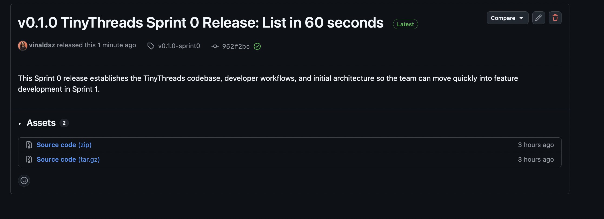

# Sprint Evidence — Sprint 1

This document captures the sprint planning artifacts, execution evidence, SCRUM ceremonies, and the Working MVP deliverable required by the rubric. Fill in the items below with links, dates, screenshots and short notes. Use this as the canonical sprint evidence file and link it from the README and Project board.

---

## Quick checklist (submission)

- [.] Sprint Goal in GitHub Milestone or Project description
- [.] GitHub Projects board configured with Sprint 1 items
- [.] All Sprint 1 issues show status transition history (visible in issue activity)
- [.] Minimum 3 standup logs with dates and issue references
- [x] Sprint Review notes with Product Owner (professor) feedback
- [.] Retrospective document with velocity and action items
- [.] Live MVP URL or clear access instructions in README
- [.] MVP description with value proposition
- [.] Git history shows multiple commits from all team members
- [.] All committed issues closed with linked PRs/commits
- [.] Evidence of Product Owner engagement throughout sprint

---

# Section 1 — Sprint Planning Artifacts (25 points)

## Sprint Goal (10 points)

- Sprint Goal:
  - Sprint Goal: 60‑second listing marketplace
  - Milestone / Project link:
    - Milestones: https://github.com/vinaldsz/TinyThreads/milestones
    - Projects: https://github.com/vinaldsz/TinyThreads/projects

## Sprint Backlog (10 points)

- GitHub Project / Board link:
  - Repository Projects: https://github.com/vinaldsz/TinyThreads/projects
- Sprint start date: 2025-10-12 Sprint end date: 2025-10-26
- Committed backlog items (list each issue number + short title + estimate + acceptance criteria):
  - Issue #26 — Documentation and GitHub Related Activities
    - Link: https://github.com/vinaldsz/TinyThreads/issues/26
    - Estimate: 2
    - Acceptance criteria:
      1. Documentation updated
      2. Evidence links inserted
  - Issue #20 — Create MongoDB Atlas Database
    - Link: https://github.com/vinaldsz/TinyThreads/issues/20
    - Estimate: 2
    - Acceptance criteria:
      1. Backend can successfully connect to MongoDB
      2. Can perform CRUD operations on all collections
      3. Connection string stored securely in environment variables
      4. Database accessible from all team members' IPs
  - Issue #1 — Browse SecondHand Baby clothes and items
    - Link: https://github.com/vinaldsz/TinyThreads/issues/1
    - Estimate: 5
    - Acceptance criteria:
      1. Given the user is on the marketplace homepage, when they open available sections [“Baby Clothes","Toys”] , then they should see a list/grid of available associated second-hand items.
      2. Given items are listed, when an item is out of stock or sold, then it should not appear in the list (or be clearly marked as “Sold”).
      3. Given the user clicks on an item, when they view the item’s detail page, then they should see its title, description, price, size/age range, location, and seller contact details.
      4. Given the user is browsing items, when they scroll down, then additional items should load automatically or via a “Load more” button.
  - Issue #22 — Set Up Backend - Node.js + Express
    - Link: https://github.com/vinaldsz/TinyThreads/issues/22
    - Estimate: 2
    - Acceptance criteria:
      1. Server starts without errors
      2. Health check endpoint returns JSON
      3. Server auto-restarts on file changes (nodemon)
  - Issue #21 —Configure AWS s3 Object Storage
    - Link: https://github.com/vinaldsz/TinyThreads/issues/21
    - Estimate: 2
    - Acceptance criteria:
      1. Backend can upload an image file to the S3 bucket
      2. Receive valid public_id and secure_url in response
      3. Can generate thumbnail, medium, large URLs
      4. Images served over HTTPS
  - Issue #2 — Quick listing creation for outgrown baby clothes.
    - Link: https://github.com/vinaldsz/TinyThreads/issues/2
    - Estimate: 5
    - Acceptance criteria:
      1. Given the user opens the “Create Listing” form, when they enter the item name, size, upload at least one photo, give a neighborhood location and set a price, then the system should allow submission.
      2. Given the user uploads photos, when the upload is complete, then a thumbnail preview should be displayed.
      3. Given the user submits the form, when the listing is created, then it should display correctly in both the user’s listings and public search results with all entered details.
      4. Given any required information is missing, when the user tries to submit, then the system should prevent submission and highlight missing fields.

## Sprint Planning Meeting Summary (5 points)

Refer to `Sprint Planning Artifacts.pdf` in the repo.

---

# Section 2 — Sprint Execution Evidence (20 points)

## Issue Completion (10 points)

For each committed backlog issue include:

- Issue #26 — Documentation and GitHub Related Activities
  - Status progression:
    - Created: see issue timeline — https://github.com/vinaldsz/TinyThreads/issues/26
      
- Issue #20 — Create MongoDB Atlas Database
  - Issue: https://github.com/vinaldsz/TinyThreads/issues/20
    
- Issue #1 — Browse SecondHand Baby clothes and items
  - Issue: https://github.com/vinaldsz/TinyThreads/issues/1
    
- Issue #22 — Set Up Backend - Node.js + Express
  - Issue: https://github.com/vinaldsz/TinyThreads/issues/22
    
- Issue #21 — Configure AWS s3 Object Storage
  - Issue: https://github.com/vinaldsz/TinyThreads/issues/21
    
- Issue #2 — Quick listing creation for outgrown baby clothes
  - Issue: https://github.com/vinaldsz/TinyThreads/issues/2
    

## Git History & Issue Tracking (10 points)

- Incremental development evidence:
  - Representative branches:
    - main — https://github.com/vinaldsz/TinyThreads/tree/main
    - feature/browse-items-frontend — https://github.com/vinaldsz/TinyThreads/tree/feature/browse-items-frontend
    - feature/browse-items-fixed — https://github.com/vinaldsz/TinyThreads/tree/feature/browse-items-fixed
    - feature/backend-mongo-add-listing — https://github.com/vinaldsz/TinyThreads/tree/feature/backend-mongo-add-listing
    - feature/add-listing — https://github.com/vinaldsz/TinyThreads/tree/feature/add-listing
  - Contributors this sprint: @vinaldsz, @abhishektuteja01, @Xiaow7123
- Branch & PR usage:

  - Feature branches used this sprint:
    - feature/browse-items-frontend — https://github.com/vinaldsz/TinyThreads/tree/feature/browse-items-frontend
    - feature/browse-items-fixed — https://github.com/vinaldsz/TinyThreads/tree/feature/browse-items-fixed
    - feature/backend-mongo-add-listing — https://github.com/vinaldsz/TinyThreads/tree/feature/backend-mongo-add-listing
    - feature/add-listing — https://github.com/vinaldsz/TinyThreads/tree/feature/add-listing

- Project board activity:
  - Board: https://github.com/vinaldsz/TinyThreads/projects
  - Milestones: https://github.com/vinaldsz/TinyThreads/milestones
  - Insights: https://github.com/vinaldsz/TinyThreads/pulse

---

# Section 3 — SCRUM Ceremonies Documentation

## Daily Standups

- Refer to `docs/Sprint Planning Artifacts.pdf` section `4. Daily Standup`

## Sprint Review

- Date of Review: 2025-10-26
- Attendees: Vinal Dalcy Dsouza, Abhishek Tuteja, Xiaowei Qi Product Owner: Professor - Recording shared on slack.
- Demo evidence:
  - Recorded Demo: [(https://teams.microsoft.com/l/meetingrecap?driveId=b%21i7p5KKti8Eeh1Q0UcFDQV_6nR1NNdbZLhlYhutwUq0vT5egkiiKOR7O5TjP2Razz&driveItemId=0122HFCPUOPIBNFUNDZJFZHA4XWZ7GWRLC&sitePath=https%3A%2F%2Fnortheastern-my.sharepoint.com%2Fpersonal%2Fdsouza_vi_northeastern_edu%2FDocuments%2FRecordings%2FSprint%2520Review%2520%2B%2520Sprint%2520Retrospective-20251026_185007-Meeting%2520Recording.mp4&fileUrl=https%3A%2F%2Fnortheastern-my.sharepoint.com%2Fpersonal%2Fdsouza_vi_northeastern_edu%2FDocuments%2FRecordings%2FSprint%2520Review%2520%2B%2520Sprint%2520Retrospective-20251026_185007-Meeting%2520Recording.mp4&iCalUid=040000008200E00074C5B7101A82E008000000009B29A366D346DC010000000000000000100000009D01CCB49175F54BB5685C3090F807C2&threadId=19%3Ameeting_ZDUwYTJhNWUtNDE3ZS00ZWI1LTgyODEtZGEwODM5ZTE1ODI5%40thread.v2&organizerId=3570b866-e7ce-4147-bcd9-8350e2a97a98&tenantId=a8eec281-aaa3-4dae-ac9b-9a398b9215e7&callId=4bb0dec7-e647-4a9b-8ff2-67aa331fad62&threadType=Meeting&meetingType=Scheduled&subType=RecapSharingLink_RecapCore)]
  - Live URL: [(https://tiny-threads-ten.vercel.app)]
- Product Owner feedback (capture verbatim if possible)
- Which items accepted or not:
  - Accepted: [issue numbers]
  - Not accepted: [issue numbers]

## Sprint Retrospective

- Date: 2025-10-25
- Present: Vinal Dalcy Dsouza, Abhishek Tuteja, Xiaowei Qi
- Velocity:
  - Planned story points: 20
  - Completed story points: 20
  - Velocity this sprint: 20 (100%)
- Retro answers:
  - What went well:
    1. Completed all sprint goals within the estimated capacity.
    2. Improved Collaboration between team.
  - What could have been better:
    1. Lack of knowledge in the tech stack caused minor delay.
    2. Multiple merge conflicts and inconsistent code formatting in Sprint 0.
  - What will we do differently:
    1. Better plan and have issues associated with knowledge.
    2. Implement a standardized pull request (PR) review checklist.
- Actionable improvements (at least 2–3), owners and issues:
  - Improvement 1: Conduct a short knowledge-sharing session or create internal documentation to improve familiarity with the tech stack [#31]
  - Improvement 2: Implement a PR review checklist and enforce branch protection rules to reduce merge conflicts and maintain consistent code quality [#32]
  - Improvement 3: Ensure each story includes linked learning or research subtasks when new technology is involved, to improve planning accuracy [#33]

---

# Section 4 — Working MVP Deliverable (25 points)

## MVP Definition & Value Proposition (10 points)

- MVP description: A marketplace that enables parents to list and browse second-hand baby clothes and toys in under 60 seconds per item.

- Key capabilities (MVP):

- Browse local inventory by size, category (clothes/toys), and condition.
- Create a listing in ~60 seconds: photo(s), size, brief title, price, and short description.
- Optional client-side compression, then upload to S3.

- Backlog items covered:

  - [#1], [#2], [#21], [#22], [#20], [#26]

- MVP Release: https://github.com/vinaldsz/TinyThreads/releases/tag/v0.1.0-sprint0
  

- User Problem this MVP solves

1. Primary user problem

Parents waste money buying baby clothes that are only used for a short period, and disposing of them is either time-consuming (listing individually) or yields little financial return (donation).

2. Specific pain points surfaced in interviews and how the MVP addresses them

- Problem 1: Time investment vs. return

  - User quote (Tiffany): "I tried Facebook Marketplace once, but it was such a hassle - taking photos, meeting strangers. Now I just donate and take the tax deduction."
  - How MVP solves: 60-second listing creation means the effort is worth the return; quicker listings increase the chance of selling.

- Problem 2: Clutter & storage

  - User quote (Bhavi): "Sorting takes a weekend; frustrating and feels wasteful."
  - How MVP solves: Quick listing and deletion mean items don't pile up; easier turnover reduces household clutter.

- Problem 3: Finding right size quickly

  - User quote (Cathy): "Growth spurt happened overnight. Spent whole morning on failed Target trips."
  - How MVP solves: Browse by size and see local inventory instantly so parents can find available items fast.

- Problem 4: Wastefulness

  - User quote (Bhavi): "Biggest frustration: waste of barely worn outfits."
  - How MVP solves: Easy resale reduces waste and helps families recoup value from lightly worn items.

- Value proposition — how TinyThreads is better than alternatives

Current alternatives (users' pain points):

- Facebook Marketplace:
  - Takes 10+ minutes to list each item individually.
  - Search results are noisy and often irrelevant (search "2T" can return unrelated electronics or adult items).
  - Generic platform not optimized for baby clothes.
- Physical consignment stores:
  - Limited hours of operation (closed evenings/weekends).
  - High commission fees (30–50%).

How TinyThreads MVP adds value:

- Speed — 10x faster listing

  - Them: ~10 minutes per item on Facebook Marketplace
  - Us: ~60 seconds per listing in TinyThreads
  - Value: Save hours when selling multiple items; lower friction improves supply and listing frequency.

- Relevance — baby-specific

  - Them: Search through random, unrelated items
  - Us: Only baby clothes (0–5 years) and toys, categorized by size and type
  - Value: Buyers find the right items in seconds; sellers reach a highly relevant audience.

- Product Owner alignment:
  1. Inclusion of Description in the milestone - Based on feedback in class
  2. Changing the priority board titles to reflect Scrum names - Change 'ready' to 'To Do'
  3. Actively change the status of issues to reflect the current state.

## Working & Accessible MVP (15 points)

- Deployment / Access:
  - Live URL: [(https://tiny-threads-ten.vercel.app)]
  - README should include deployment and access steps: https://github.com/vinaldsz/TinyThreads#readme
- Functionality evidence:
  - Demo Link: [https://teams.microsoft.com/l/meetingrecap?driveId=b%21i7p5KKti8Eeh1Q0UcFDQV_6nR1NNdbZLhlYhutwUq0vT5egkiiKOR7O5TjP2Razz&driveItemId=0122HFCPUOPIBNFUNDZJFZHA4XWZ7GWRLC&sitePath=https%3A%2F%2Fnortheastern-my.sharepoint.com%2F%3Av%3A%2Fg%2Fpersonal%2Fdsouza_vi_northeastern_edu%2FEY56AtLRo8pLk4OXtn5rRWIBWPWKNShgsVCj3EGsG_7Naw&fileUrl=https%3A%2F%2Fnortheastern-my.sharepoint.com%2Fpersonal%2Fdsouza_vi_northeastern_edu%2FDocuments%2FRecordings%2FSprint%2520Review%2520%2B%2520Sprint%2520Retrospective-20251026_185007-Meeting%2520Recording.mp4%3Fweb%3D1&iCalUid=040000008200E00074C5B7101A82E008000000009B29A366D346DC010000000000000000100000009D01CCB49175F54BB5685C3090F807C2&threadId=19%3Ameeting_ZDUwYTJhNWUtNDE3ZS00ZWI1LTgyODEtZGEwODM5ZTE1ODI5%40thread.v2&organizerId=3570b866-e7ce-4147-bcd9-8350e2a97a98&tenantId=a8eec281-aaa3-4dae-ac9b-9a398b9215e7&callId=4bb0dec7-e647-4a9b-8ff2-67aa331fad62&threadType=Meeting&meetingType=Scheduled&subType=RecapSharingLink_RecapCore]

---

# Documentation Quality

- README: https://github.com/vinaldsz/TinyThreads#readme
- docs/ folder: https://github.com/vinaldsz/TinyThreads/tree/main/docs
- Project board: https://github.com/vinaldsz/TinyThreads/projects

---
