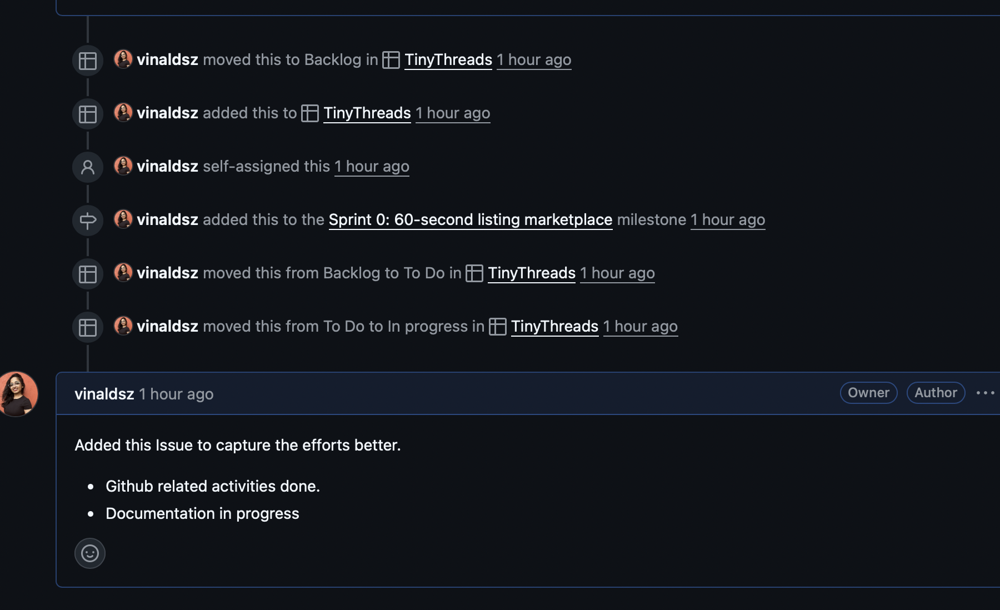
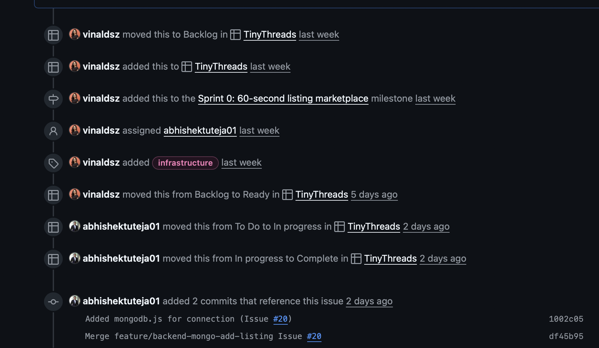
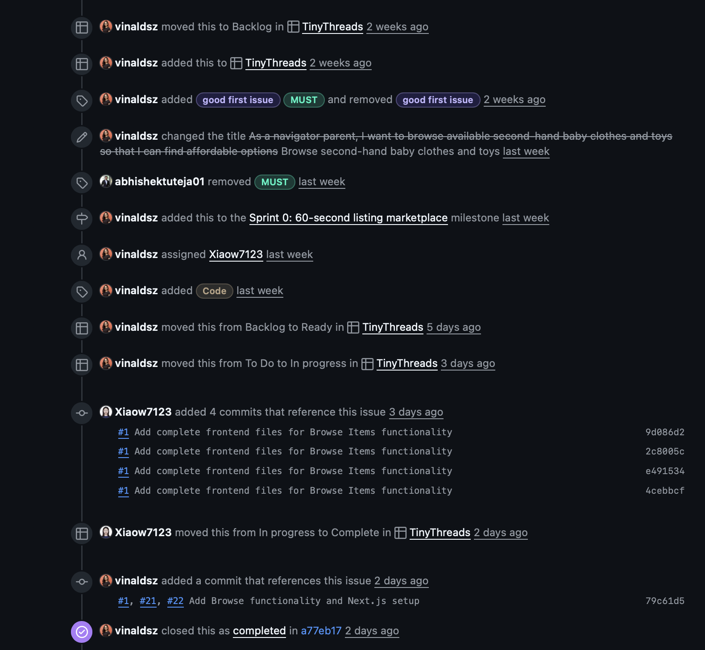
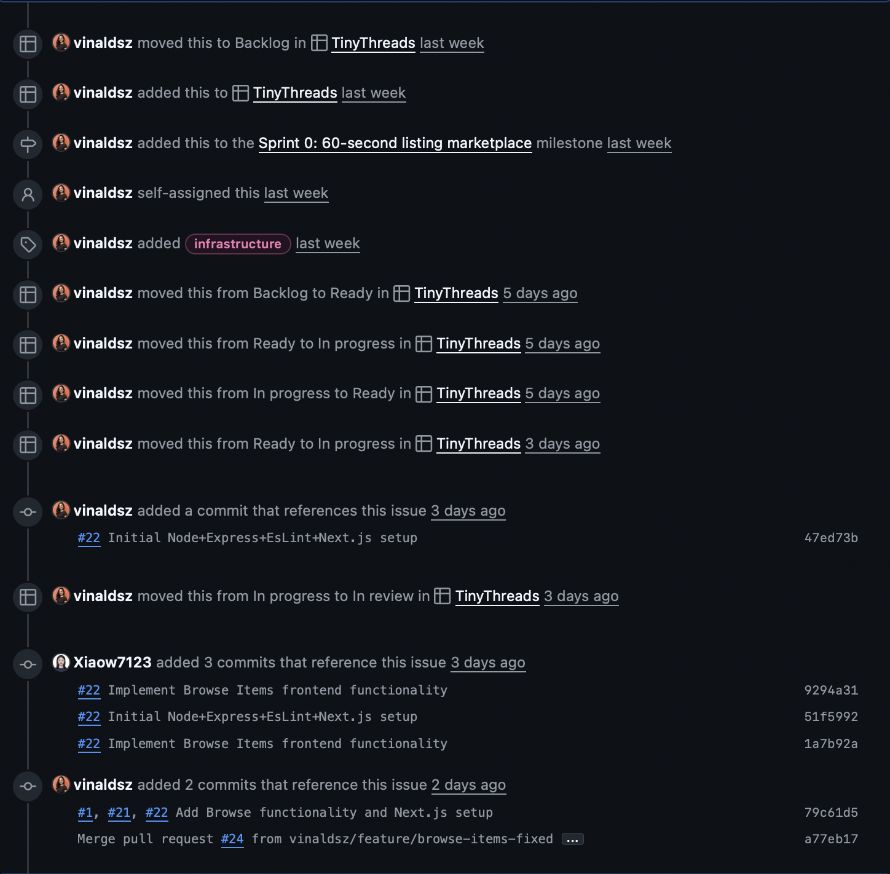
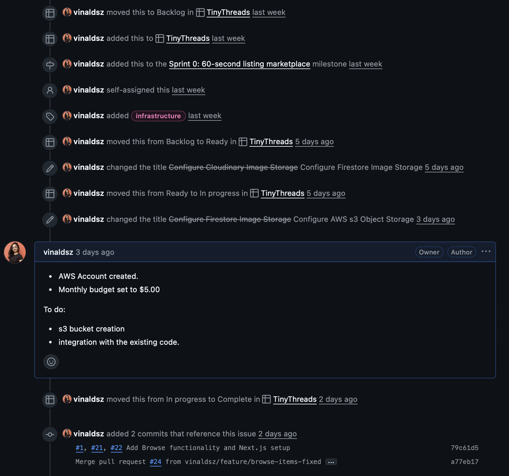
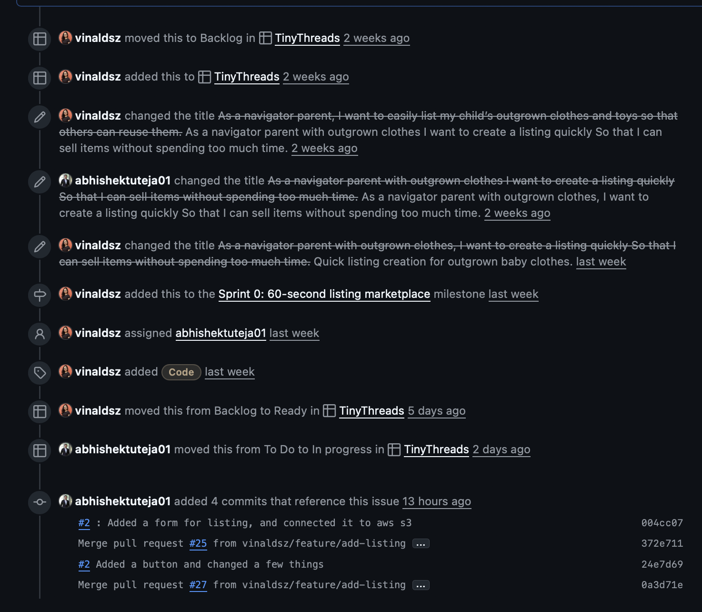

# Sprint Evidence — Sprint 1

This document captures the sprint planning artifacts, execution evidence, SCRUM ceremonies, and the Working MVP deliverable required by the rubric. Fill in the items below with links, dates, screenshots and short notes. Use this as the canonical sprint evidence file and link it from the README and Project board.

---

## Quick checklist (submission)

- [ ] Sprint Goal in GitHub Milestone or Project description
- [ ] GitHub Projects board configured with Sprint 1 items
- [ ] All Sprint 1 issues show status transition history (visible in issue activity)
- [ ] Minimum 3 standup logs with dates and issue references
- [ ] Sprint Review notes with Product Owner (professor) feedback
- [ ] Retrospective document with velocity and action items
- [ ] Live MVP URL or clear access instructions in README
- [ ] MVP description with value proposition
- [ ] Git history shows multiple commits from all team members
- [ ] All committed issues closed with linked PRs/commits
- [ ] Evidence of Product Owner engagement throughout sprint

---

# Section 1 — Sprint Planning Artifacts (25 points)

## Sprint Goal (10 points)

- Sprint Goal:
  - Sprint Goal: 60‑second listing marketplace
  - Milestone / Project link:
    - Milestones: https://github.com/vinaldsz/TinyThreads/milestones
    - Projects: https://github.com/vinaldsz/TinyThreads/projects

## Sprint Backlog (10 points)

- GitHub Project / Board link:
  - Repository Projects: https://github.com/vinaldsz/TinyThreads/projects
- Sprint start date: 2025-10-12 Sprint end date: 2025-10-26
- Committed backlog items (list each issue number + short title + estimate + acceptance criteria):
  - Issue #26 — Documentation and GitHub Related Activities
    - Link: https://github.com/vinaldsz/TinyThreads/issues/26
    - Estimate: 2
    - Acceptance criteria:
      1. Documentation updated
      2. Evidence links inserted
  - Issue #20 — Create MongoDB Atlas Database
    - Link: https://github.com/vinaldsz/TinyThreads/issues/20
    - Estimate: 2
    - Acceptance criteria:
      1. Backend can successfully connect to MongoDB
      2. Can perform CRUD operations on all collections
      3. Connection string stored securely in environment variables
      4. Database accessible from all team members' IPs
  - Issue #1 — Browse SecondHand Baby clothes and items
    - Link: https://github.com/vinaldsz/TinyThreads/issues/1
    - Estimate: 5
    - Acceptance criteria:
      1. Given the user is on the marketplace homepage, when they open available sections [“Baby Clothes","Toys”] , then they should see a list/grid of available associated second-hand items.
      2. Given items are listed, when an item is out of stock or sold, then it should not appear in the list (or be clearly marked as “Sold”).
      3. Given the user clicks on an item, when they view the item’s detail page, then they should see its title, description, price, size/age range, location, and seller contact details.
      4. Given the user is browsing items, when they scroll down, then additional items should load automatically or via a “Load more” button.
  - Issue #22 — Set Up Backend - Node.js + Express
    - Link: https://github.com/vinaldsz/TinyThreads/issues/22
    - Estimate: 2
    - Acceptance criteria:
      1. Server starts without errors
      2. Health check endpoint returns JSON
      3. Server auto-restarts on file changes (nodemon)
  - Issue #21 —Configure AWS s3 Object Storage
    - Link: https://github.com/vinaldsz/TinyThreads/issues/21
    - Estimate: 2
    - Acceptance criteria:
      1. Backend can upload an image file to the S3 bucket
      2. Receive valid public_id and secure_url in response
      3. Can generate thumbnail, medium, large URLs
      4. Images served over HTTPS
  - Issue #2 — Quick listing creation for outgrown baby clothes.
    - Link: https://github.com/vinaldsz/TinyThreads/issues/2
    - Estimate: 5
    - Acceptance criteria:
      1. Given the user opens the “Create Listing” form, when they enter the item name, size, upload at least one photo, give a neighborhood location and set a price, then the system should allow submission.
      2. Given the user uploads photos, when the upload is complete, then a thumbnail preview should be displayed.
      3. Given the user submits the form, when the listing is created, then it should display correctly in both the user’s listings and public search results with all entered details.
      4. Given any required information is missing, when the user tries to submit, then the system should prevent submission and highlight missing fields.

## Sprint Planning Meeting Summary (5 points)

Refer to `Sprint Planning Artifacts.pdf` in the repo.

---

# Section 2 — Sprint Execution Evidence (20 points)

## Issue Completion (10 points)

For each committed backlog issue include:

- Issue #26 — Documentation and GitHub Related Activities
  - Status progression:
    - Created: see issue timeline — https://github.com/vinaldsz/TinyThreads/issues/26
      
- Issue #20 — Create MongoDB Atlas Database
  - Issue: https://github.com/vinaldsz/TinyThreads/issues/20
    
- Issue #1 — Browse SecondHand Baby clothes and items
  - Issue: https://github.com/vinaldsz/TinyThreads/issues/1
    
- Issue #22 — Set Up Backend - Node.js + Express
  - Issue: https://github.com/vinaldsz/TinyThreads/issues/22
    
- Issue #21 — Configure AWS s3 Object Storage
  - Issue: https://github.com/vinaldsz/TinyThreads/issues/21
    
- Issue #2 — Quick listing creation for outgrown baby clothes
  - Issue: https://github.com/vinaldsz/TinyThreads/issues/2
    

## Git History & Issue Tracking (10 points)

- Incremental development evidence:
  - Representative branches:
    - main — https://github.com/vinaldsz/TinyThreads/tree/main
    - feature/browse-items-frontend — https://github.com/vinaldsz/TinyThreads/tree/feature/browse-items-frontend
    - feature/browse-items-fixed — https://github.com/vinaldsz/TinyThreads/tree/feature/browse-items-fixed
    - feature/backend-mongo-add-listing — https://github.com/vinaldsz/TinyThreads/tree/feature/backend-mongo-add-listing
    - feature/add-listing — https://github.com/vinaldsz/TinyThreads/tree/feature/add-listing
  - Contributors this sprint: @vinaldsz, @abhishektuteja01, @Xiaow7123
- Branch & PR usage:

  - Feature branches used this sprint:
    - feature/browse-items-frontend — https://github.com/vinaldsz/TinyThreads/tree/feature/browse-items-frontend
    - feature/browse-items-fixed — https://github.com/vinaldsz/TinyThreads/tree/feature/browse-items-fixed
    - feature/backend-mongo-add-listing — https://github.com/vinaldsz/TinyThreads/tree/feature/backend-mongo-add-listing
    - feature/add-listing — https://github.com/vinaldsz/TinyThreads/tree/feature/add-listing

- Project board activity:
  - Board: https://github.com/vinaldsz/TinyThreads/projects
  - Milestones: https://github.com/vinaldsz/TinyThreads/milestones
  - Insights: https://github.com/vinaldsz/TinyThreads/pulse

---

# Section 3 — SCRUM Ceremonies Documentation (30 points)

## Daily Standups (10 points)

- Provide at least 3 standup logs (synchronous minutes or asynchronous comments)
  - Standup 1 — YYYY-MM-DD
    - @user1: Yesterday I finished X. Today I'll work on Y. Blocker: Z.
  - Standup 2 — YYYY-MM-DD
  - Standup 3 — YYYY-MM-DD
- Evidence that blockers were addressed:
  - Link issue or comment where blocker was resolved.

## Sprint Review (10 points)

- Date of Review: YYYY-MM-DD
- Attendees: @user1, @user2, @user3, Product Owner: @professor (or documented attempt)
- Demo evidence:
  - Live URL: [INSERT LIVE URL]
  - Recorded demo: [INSERT LINK]
- Product Owner feedback (capture verbatim if possible)
- Which items accepted or not:
  - Accepted: [issue numbers]
  - Not accepted: [issue numbers]

## Sprint Retrospective (10 points)

- Date: YYYY-MM-DD
- Present: @user1, @user2, @user3
- Velocity:
  - Planned story points: X
  - Completed story points: Y
  - Velocity this sprint: Y
- Retro answers:
  - What went well:
  - What could have been better:
  - What will we do differently:
- Actionable improvements (at least 2–3), owners and issues:
  - Improvement 1: [description] — Owner: @user — Issue: [link]

---

# Section 4 — Working MVP Deliverable (25 points)

## MVP Definition & Value Proposition (10 points)

- MVP version: vX.Y.Z — create a GitHub Release at: https://github.com/vinaldsz/TinyThreads/releases
- MVP description:
  - Features included:
    - [List features and link to issues]
  - Backlog items covered:
    - [List of issue links above]
- Product Owner alignment: [Describe alignment]

## Working & Accessible MVP (15 points)

- Deployment / Access:
  - Live URL: [INSERT]
  - README should include deployment and access steps: https://github.com/vinaldsz/TinyThreads#readme
- Functionality evidence:
  - Screenshots: add to docs/assets and reference here
  - Walkthrough steps: [INSERT]

---

# Documentation Quality

- README: https://github.com/vinaldsz/TinyThreads#readme
- docs/ folder: https://github.com/vinaldsz/TinyThreads/tree/main/docs
- Project board: https://github.com/vinaldsz/TinyThreads/projects

---
